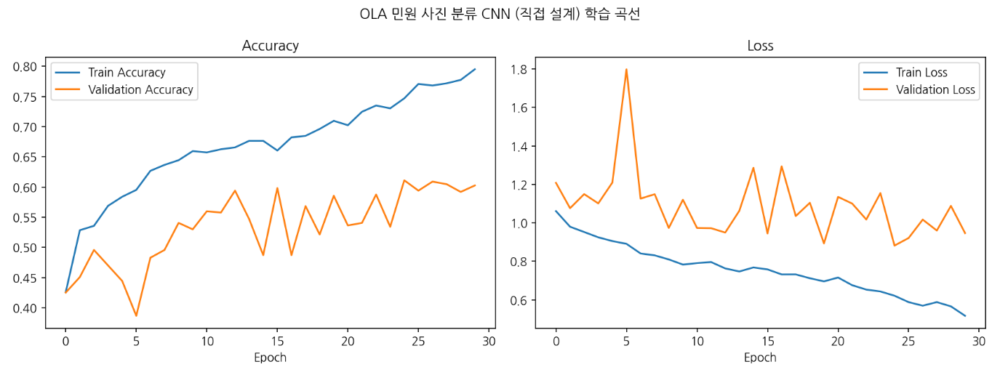
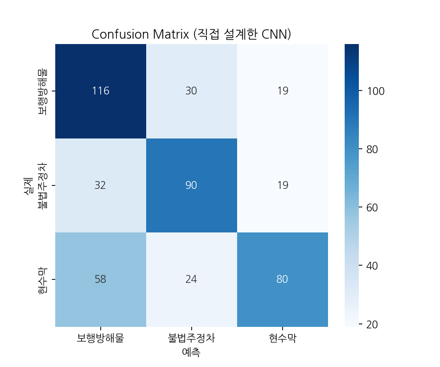
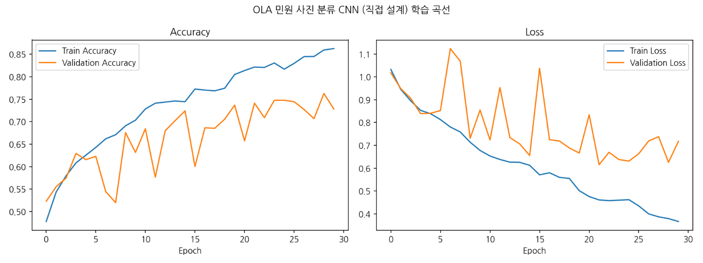
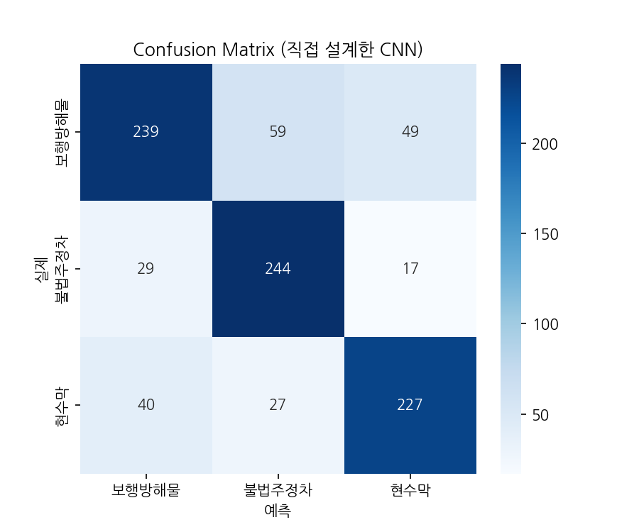

# OLA 민원 사진 분류 CNN — 직접 설계 모델 실험 분석 보고서

국비교육 조별 프로젝트 · PyTorch 직접 설계 CNN 실험 기록

## 1. 개요

본 프로젝트는 CCTV 등에서 촬영된 민원 사진을 불법주정차, 보행방해물, 현수막 3개 카테고리로 분류하는 이미지 분류 모델을 사전학습 가중치 없이 PyTorch로 직접 설계·학습한 실험이다.

모델 구조는 [Conv2d → BatchNorm2d → ReLU] × 2 → MaxPool2d 블록을 4단(채널 3→32→64→128→256) 쌓고, Global Average Pooling과 Fully Connected 분류층을 연결한 CNN이다. 입력 해상도는 128×128, 배치 크기 32, 총 30 epoch, Adam 옵티마이저(lr 1e-3, weight decay 1e-4), ReduceLROnPlateau 스케줄러, 클래스 불균형 보정을 위한 가중치가 적용된 CrossEntropyLoss를 사용했다.

데이터는 같은 영상(카메라)에서 나온 프레임이 train/val에 함께 섞이지 않도록 영상 단위(GroupShuffleSplit)로 분리하여, 검증 정확도가 데이터 유출로 비정상적으로 높게 나오는 것을 방지했다.

## 2. 실험 진행 경과

학습은 직접 설계 CNN 기준 총 다섯 차례(그리고 전이학습 비교 1회) 진행되었으며, 그 과정에서 세 가지 중요한 이슈(실수로 인한 재학습, 클래스 라벨 인코딩 깨짐, 크롭 파이프라인 설계 결함)가 발견되어 함께 정리한다.

| 구분 | 내용 | 결과 |
|---|---|---|
| 1차 학습 | 최초 학습 | 검증 정확도 약 65% |
| 학습 사고 | 실수로 학습을 한 번 더 실행하여 처음부터 재학습 진행됨 | 동일 코드·데이터로 재학습되는 것이라 결과에 실질적 문제 없음 (시간 손실만 발생) |
| 2차 학습 | 30 epoch 완료 (클래스 폴더명 인코딩 깨짐 상태) | 검증 정확도 약 62.4% (292/468) |
| 이슈 발견/수정 | zip 압축 해제 시 한글 폴더명이 깨지는 인코딩 문제 발견 및 수정 | 아래 5장 참고 |
| 3차 학습 | 클래스명 정상화 후 재학습 완료 | 검증 정확도 61.1% (286/468) |
| 원인 분석 | Grad-CAM으로 현수막 오분류 원인 분석 → 크롭 파이프라인의 컨텍스트 배수(CONTEXT_MULTIPLIER) 설계 결함 확인 | 아래 6·7장 참고 |
| 4차 학습 | 카테고리별 컨텍스트 배수 적용 후 재크롭 → 재학습 | 최고 검증 정확도 76.3% (710/931) · 최종 모델로 확정 |

1~3차 결과가 모두 61~65% 구간에 수렴한 것은 우연이 아니라 당시 데이터·크롭 설계 조합에서의 실질적인 성능 상한에 가까웠던 것으로 판단되며, 4차 학습에서 크롭 파이프라인을 수정한 뒤 검증 정확도가 76.3%까지 크게 개선되어 이 판단이 뒷받침되었다. 4차 학습에 대한 상세 내용은 8장에서 다룬다. 이후 5차 실험에서 데이터를 8,453장으로 확대하고 학습 레시피를 개선해 86.3%까지 도달했으며, 동일 조건의 전이학습(ResNet18) 비교 실험에서는 93.1%를 기록했다(9~10장).

## 3. 학습 곡선 분석 (과적합 여부)

2차·3차 학습 모두 학습 곡선에서 뚜렷한 과적합 패턴이 관찰되었다.

Train accuracy는 30 epoch에 걸쳐 꾸준히 상승하여 약 79~80%까지 도달한 반면, Validation accuracy는 20 epoch 이후 60~62% 구간에서 정체되었다. Loss 그래프에서는 Validation loss가 8~10 epoch 부근에서 최저점(약 0.9)을 찍은 뒤 더 이상 낮아지지 않고 오히려 소폭 상승하는 반면, Train loss는 계속 감소(0.5대까지)하여 두 곡선 사이의 간격(gap)이 벌어지는 전형적인 과적합 형태를 보였다.



**개선 제안**

- Validation loss가 최저였던 epoch(8~10 부근) 시점의 가중치를 기준으로 Early stopping 적용 검토
- Dropout·weight decay 등 정규화 강화 및 데이터 증강(augmentation) 다양화
- 모델 자체보다 데이터 특성(4장, 6장 참고)이 정확도 상한의 더 큰 요인일 가능성이 높음

## 4. Confusion Matrix 기반 클래스별 성능 분석

클래스명 인코딩 문제를 해결한 3차 학습 결과 기준으로 분석한다. 전체 검증 정확도는 61.1%(286/468)이다.

| 클래스 | Precision | Recall | F1-score | Support |
|---|---|---|---|---|
| 보행방해물 | 0.56 | 0.70 | 0.63 | 165 |
| 불법주정차 | 0.62 | 0.64 | 0.63 | 141 |
| 현수막 | 0.68 | 0.49 | 0.57 | 162 |
| **accuracy** | | | **0.61** | 468 |
| macro avg | 0.62 | 0.61 | 0.61 | 468 |

**Confusion Matrix (행: 실제, 열: 예측)**

| 실제 \ 예측 | 보행방해물 | 불법주정차 | 현수막 |
|---|---|---|---|
| 보행방해물 | 116 | 30 | 19 |
| 불법주정차 | 32 | 90 | 19 |
| 현수막 | 58 | 24 | 80 |



- 현수막 recall이 0.49로 가장 낮다. 162건 중 58건(36%)이 보행방해물로, 24건(15%)이 불법주정차로 오분류되었다.
- 보행방해물은 recall(0.70)은 높지만 precision(0.56)이 가장 낮다. 즉 모델이 애매한 경우 보행방해물로 판단하는 경향이 있으며, 실제로는 불법주정차 30건, 현수막 58건이 보행방해물로 잘못 끌려왔다.
- 불법주정차는 precision 0.62, recall 0.64로 세 클래스 중 상대적으로 안정적이다.
- 불법주정차↔보행방해물 간 교차 오분류(32건, 30건)는 개념적으로 어느 정도 불가피한 측면이 있다. 인도를 막고 불법주차된 차량은 그 자체로 보행방해물이기도 하기 때문이다.

## 5. 데이터 라벨 인코딩 이슈와 해결

2차 학습 결과 확인 중 class_names 및 confusion matrix 축 라벨이 알아볼 수 없는 문자로 깨지는 현상이 발견되었다.

**원인**

데이터셋 zip 파일 내 한글 폴더명(불법주정차/보행방해물/현수막)이 Windows 환경의 CP949(EUC-KR 계열) 인코딩으로 저장되어 있었다. zip 포맷은 파일명 인코딩을 항상 명시하지는 않으며, Colab(Linux)의 unzip 명령은 별도 지정이 없으면 UTF-8로 가정하고 해석한다. 이 불일치로 인해 CP949 바이트열이 엉뚱한 유니코드 문자로 해석되는 mojibake(문자 깨짐) 현상이 발생했다.

**해결**

```bash
!rm -rf /content/dataset
!mkdir -p /content/dataset
!unzip -O CP949 -q "$ZIP_PATH" -d /content/dataset
```

unzip에 원본 인코딩(CP949)을 명시적으로 지정하여 압축을 다시 풀어 폴더명을 정상화했다. 이후 재학습을 통해 class_names, classification report, confusion matrix 라벨이 모두 정상적으로 표시되었다.

## 6. Grad-CAM 기반 오분류 원인 분석

현수막 recall이 가장 낮은 원인을 파악하기 위해, 검증셋에서 실제 현수막이지만 다르게 예측된 82개 샘플 전체에 Grad-CAM을 적용해 모델이 이미지의 어느 영역에 근거해 판단했는지 시각화했다.

**방법**

모델의 마지막 Conv 블록(8×8×256 특징맵)을 대상으로, 예측 클래스 점수에 대한 그래디언트를 채널별 전역 평균으로 가중합하여 클래스 활성화 히트맵을 생성했다(Grad-CAM). 82개 오분류 샘플 전체를 10장씩 나누어 육안으로 검토했다.

> Grad-CAM 시각화 이미지는 AI Hub 원본 민원 사진을 포함하고 있어 이용약관에 따라 이 저장소에는 포함하지 않는다. 아래는 시각화 결과를 육안으로 검토해 정리한 요약이다. (출처: AI Hub(aihub.or.kr) "종합 민원 이미지 AI데이터", 제공: 고양시, 한국지능정보사회진흥원)

**발견된 오분류 패턴 3가지**

| 패턴 | 설명 | 원인 | 해결 방향 |
|---|---|---|---|
| A | 현수막이 크롭 프레임 안에 거의/전혀 보이지 않음 | 컨텍스트 확대(3배) 및 경계 보정 로직으로 대상 객체가 프레임 밖으로 밀려나거나 극소 영역만 남음 (7장 참고) | 카테고리별 컨텍스트 배수 축소 및 재크롭 |
| B | 현수막은 보이나 작고 가장자리에 위치, 인근의 더 크고 두드러진 물체(차량 등)에 모델의 attention이 집중됨 | 동일 원인: 컨텍스트 배수 3.0을 전 카테고리 균일 적용 → 현수막이 상대적으로 작고 저대비(흰색 계열)로 표현됨 | 현수막 카테고리 컨텍스트 배수 축소(예: 1.5) |
| C | 현수막을 정확히 보고 있음에도(Grad-CAM이 배너 위에 위치) 보행방해물로 오분류(확신도 0.9 이상 포함) | 실제 시각적 유사성: 적/백색 줄무늬 배너형 현수막이 보행방해물류의 경고 깃발·폴대·바리케이드와 형태적으로 유사 | 보행방해물 폴더 내 유사 형태 객체 재검토, 필요 시 라벨링 기준 재정의 |

A, B는 크롭 파이프라인 설계(7장)에서 기인한 구조적 문제로 재크롭을 통해 개선 여지가 있으며, C는 크롭 방식과 무관하게 클래스 간 실제 시각적 유사성에서 기인하므로 별도 검토가 필요하다.

## 7. 근본 원인: 데이터 크롭 파이프라인 설계

prepare_dataset.py의 크롭 로직을 검토한 결과, 위 A·B 패턴의 구조적 원인을 확인했다.

CONTEXT_MULTIPLIER = 3.0이 불법주정차·보행방해물·현수막 3개 카테고리에 동일하게 적용된다. 크롭 한 변의 길이가 원본 박스 최대 변의 3배로 설정되므로, 실제 객체는 최종 크롭 이미지 면적의 약 1/9~1/20 정도만 차지하게 된다. 불법주정차는 차량 자체보다 도로 표시선·표지판·인도와의 관계 등 주변 맥락이 판단에 필요하므로 넓은 컨텍스트가 합리적이지만, 현수막은 객체 자체가 식별 대상이므로 동일한 비율의 컨텍스트 확대가 오히려 신호를 희석시키는 역할을 한다.

또한 compute_context_crop 함수는 크롭 영역이 원본 이미지 경계를 벗어날 경우, 크기는 유지한 채 안쪽으로 밀어 넣는(shift) 방식을 사용한다. 이로 인해 원본 이미지 가장자리 근처에 있던 객체는 크롭 결과물 안에서 중앙이 아닌 한쪽 가장자리에 위치하게 되어, 현수막의 프레임 내 위치가 사진마다 불규칙하게 나타나는 원인이 된다.

**개선 제안 코드**

```python
CONTEXT_MULTIPLIER_BY_CATEGORY = {
    "불법주정차": 3.0,  # 도로 표시선/인도 관계 파악을 위해 넓게 유지
    "보행방해물": 2.5,
    "현수막": 1.5,  # 객체 자체가 식별 대상이므로 배경 비중을 줄이고 본체 비중을 키움
}

# crop_selected 내부에서 카테고리별 배수를 사용하도록 수정
multiplier = CONTEXT_MULTIPLIER_BY_CATEGORY[cat]
left, top, right, bottom = compute_context_crop(x, y, w, h, img_w, img_h, multiplier)
```

## 8. 개선 사항 적용 및 재크롭·재학습 결과

7장에서 확인한 원인에 따라 아래 개선 사항을 실제로 적용했다.

- 카테고리별 CONTEXT_MULTIPLIER 차등 적용 (불법주정차 3.0 / 보행방해물 2.5 / 현수막 1.5) → 적용 완료
- 전체 데이터셋 재크롭 → 재학습 진행 → 완료, 아래 결과 참고
- 패턴 C(현수막↔보행방해물 시각적 유사성) 및 과적합 구간에 대한 대응은 이번 차수에서는 보류하고, 향후 과제로 9장에 정리

**데이터 재전처리 결과**

전체 이미지·라벨 589,500개를 다시 스캔하여, 카테고리별 컨텍스트 배수를 다르게 적용해 각 800장씩 균등하게 재수집했다(같은 영상에서 최대 5장까지만 사용해 다양성 확보).

| 카테고리 | 전체 박스 수 | 40px 이상 후보 | 최종 수집(영상 수) |
|---|---|---|---|
| 불법주정차 | 390,515개 | 183,010개 | 800장 (290개 영상) |
| 보행방해물 | 410,932개 | 7,068개 | 800장 (271개 영상) |
| 현수막 | 310,718개 | 48,971개 | 800장 (229개 영상) |

**4차 학습 결과**

학습 초반부터 이전 차수보다 높은 정확도로 시작했고, 중반에 학습 곡선이 흔들리며 일시적으로 과적합처럼 보이는 구간도 있었으나, 최종적으로 이전 세 차례 결과를 뚜렷하게 상회하는 최고 검증 정확도 76.3%를 기록했다.



| 클래스 | Precision | Recall | F1-score | Support |
|---|---|---|---|---|
| 보행방해물 | 0.78 | 0.69 | 0.73 | 347 |
| 불법주정차 | 0.74 | 0.84 | 0.79 | 290 |
| 현수막 | 0.77 | 0.77 | 0.77 | 294 |
| **accuracy** | | | **0.76** | 931 |
| macro avg | 0.76 | 0.77 | 0.76 | 931 |

**Confusion Matrix (행: 실제, 열: 예측)**

| 실제 \ 예측 | 보행방해물 | 불법주정차 | 현수막 |
|---|---|---|---|
| 보행방해물 | 239 | 59 | 49 |
| 불법주정차 | 29 | 244 | 17 |
| 현수막 | 40 | 27 | 227 |



**이전 결과와의 비교**

| 지표 | 3차 (배수 3.0 균일 적용) | 4차 (카테고리별 배수 적용) |
|---|---|---|
| 전체 검증 정확도 | 61.1% | 76.3% |
| 현수막 Recall | 0.49 | 0.77 |
| 보행방해물 Precision | 0.56 | 0.78 |

6장에서 Grad-CAM으로 확인한 가설(현수막 recall 저하의 주된 원인이 크롭 시 과도한 배경 컨텍스트라는 점)이 실제 개선으로 이어졌다. 특히 현수막 recall이 0.49 → 0.77로, 보행방해물 precision이 0.56 → 0.78로 크게 개선되어, 모델 구조 변경 없이 데이터 전처리 파라미터 조정만으로 전체 정확도가 약 15%p 상승했다.

다만 Train accuracy(약 86%)와 Validation accuracy(약 76%) 사이에는 여전히 10%p 내외의 격차가 남아 있어 과적합이 완전히 해소된 것은 아니다. 그러나 이번 결과를 최종 모델로 확정하는 대신, 남은 과적합과 데이터 양 문제를 해결하기 위한 5차 실험(9장)을 추가로 진행하기로 했다.

## 9. (5차) 데이터 확대 및 학습 레시피 개선

4차 결과(76.3%)에는 두 가지 한계가 남아 있었다. 첫째, Train-Validation 정확도 격차가 약 10%p로 과적합 경향이 뚜렷했고, 둘째, 원본 데이터에 58만여 개의 라벨이 있음에도 카테고리당 1,600장(총 4,800장)만 사용하고 있었다. 5차 실험에서는 모델 구조를 전혀 바꾸지 않은 채(파라미터 1,207,459개 동일) 데이터 양과 학습 방법만 개선하여, "정확도 상한을 결정하는 것은 모델 구조가 아니라 데이터와 학습 방법"이라는 기존 결론을 한 번 더 검증했다.

**데이터 확대 (재크롭)**

카테고리당 수집 상한을 800장에서 3,000장으로, 같은 영상에서 뽑는 장수 상한을 5장에서 8장으로 늘려 전체를 재크롭했다. 다만 보행방해물은 원본 박스 410,932개 중 40px 이상이 7,068개(1.7%)에 불과해 — CCTV 광각 화면에서 간이의자·입간판 같은 객체가 차량이나 현수막보다 물리적으로 작게 찍히기 때문 — 고화질 기준(크롭 한 변 150px 이상)만으로는 1,644장에서 멈췄다. 이에 보행방해물에 한해 완화 기준(90px 이상)과 영상당 상한 12장을 추가 적용해 2,453장까지 확보했다. train/validation은 4차와 동일하게 영상(그룹) 단위로 분리해 데이터 유출을 차단했다.

| 항목 | 4차 | 5차 |
|---|---|---|
| 전체 이미지 수 | 4,800장 | 8,453장 (약 1.76배) |
| 카테고리별 구성 | 각 1,600장 균등 | 불법주정차 3,000 / 현수막 3,000 / 보행방해물 2,453 |
| 서로 다른 영상(그룹) 수 | 1,021개 | 1,618개 |
| 영상당 최대 사용 장수 | 5장 | 8장 (보행방해물만 12장) |
| 학습 / 검증 분할 | 3,869 / 931장 | 6,827 / 1,626장 (그룹 단위 분리 동일) |

**학습 레시피 개선**

4차에서 검증 곡선이 epoch마다 크게 출렁이고(7~8, 16 epoch 부근 급락) 과적합이 남아 있던 문제를 학습률 관리와 정규화 강화로 대응했다. 모델 구조는 그대로 유지했다.

| 항목 | 4차 (v2) | 5차 (v3) |
|---|---|---|
| 입력 해상도 | 128×128 | 160×160 |
| 데이터 증강 | 회전·색상·이동 | RandomResizedCrop + TrivialAugmentWide + RandomErasing |
| 손실함수 | CrossEntropy (클래스 가중치) | 동일 + Label Smoothing 0.1 |
| 옵티마이저 / 스케줄러 | Adam + ReduceLROnPlateau | AdamW + Warmup(3ep) + CosineAnnealing |
| 학습 길이 | 30 epoch 고정 | 최대 60 epoch + Early Stopping (patience 12) |
| 모델 구조 | 직접 설계 CNN (1,207,459 파라미터) | 동일 (변경 없음) |

**5차 학습 결과**

최고 검증 정확도 **86.3%**를 기록해 4차 대비 10.0%p 상승했다. Warmup + Cosine 스케줄 덕분에 학습 곡선의 급락 구간도 4차보다 완만해졌다. 클래스별 성능은 아래와 같다.

| 클래스 | Precision | Recall | F1-score | Support |
|---|---|---|---|---|
| 보행방해물 | 0.85 | 0.83 | 0.84 | 595 |
| 불법주정차 | 0.82 | 0.95 | 0.88 | 470 |
| 현수막 | 0.92 | 0.83 | 0.87 | 561 |
| **전체 정확도** | | | **0.86** | 1,626 |

| 지표 | 4차 | 5차 |
|---|---|---|
| 전체 검증 정확도 | 76.3% | 86.3% |
| 현수막 Precision | 0.77 | 0.92 |
| 보행방해물 Recall | 0.69 | 0.83 |
| 불법주정차 Recall | 0.84 | 0.95 |

모델 구조를 전혀 바꾸지 않고 데이터 양(1.76배)과 학습 레시피만으로 10%p를 추가로 확보한 결과로, 11장 회고의 결론과 일치한다. 완화 기준으로 추가된 90~150px대 저해상도 크롭이 섞였음에도 데이터 양 증가의 이득이 더 컸다는 점도 확인됐다.

## 10. 전이학습(ResNet18) 비교 실험 및 최종 모델 선정

직접 설계 모델의 성능을 객관적으로 위치시키기 위해, ImageNet(약 120만 장)으로 사전학습된 ResNet18을 같은 조건에서 파인튜닝하는 비교 실험을 진행했다. 공정한 비교를 위해 5차와 완전히 동일한 데이터(8,453장)와 동일한 영상 그룹 분리를 재사용했고, 입력 해상도는 사전학습 당시와 같은 224×224, 학습률은 백본 1e-4 / 새로 교체한 분류층 1e-3의 차등 적용(AdamW), 최대 15 epoch 중 13 epoch에서 조기 종료됐다.

최고 검증 정확도는 **93.1%**로, 단 2 epoch 만에 직접 설계 모델의 최종 성능(86.3%)을 넘어섰다. 클래스별 성능은 아래와 같다.

| 클래스 | Precision | Recall | F1-score | Support |
|---|---|---|---|---|
| 보행방해물 | 0.94 | 0.90 | 0.92 | 595 |
| 불법주정차 | 0.91 | 0.97 | 0.94 | 470 |
| 현수막 | 0.94 | 0.93 | 0.93 | 561 |
| **전체 정확도** | | | **0.93** | 1,626 |

**세 모델 종합 비교**

| 모델 | 최고 검증 정확도 | 비고 |
|---|---|---|
| 직접 설계 CNN v2 (4차) | 76.3% | 카테고리별 크롭 배수 적용 |
| 직접 설계 CNN v3 (5차) | 86.3% | 구조 동일, 데이터 확대 + 레시피 개선 |
| 전이학습 ResNet18 | 93.1% | ImageNet 사전학습, 동일 데이터·동일 분리 |

**최종 모델 선정: 듀얼 모델 구성**

웹 서비스(complaint.html 사진 신고)에는 **두 모델을 모두 탑재**했으며, 기본값은 정확도가 높은 전이학습 ResNet18로 설정했다. 사진 신고 모달 상단에서 사용자가 "전이학습 ResNet18(93.1%)"과 "직접 설계 CNN(86.3%)"을 직접 전환할 수 있으며, 이미 분석한 사진은 모델 전환 즉시 재분석되어 같은 사진에 대한 두 모델의 판단을 비교할 수 있다. 실사용 품질(정확도)과 교육 프로젝트의 목적(직접 설계 모델 검증·시연)을 모두 만족하기 위한 구성이다.

두 모델 모두 ONNX(opset 18)로 변환해 onnxruntime-web(WASM)으로 브라우저에서 직접 추론하며, 서버 없이 동작한다. 입력 해상도가 서로 다르므로(ResNet18 224px / 직접 설계 160px) 전처리 코드가 모델별 해상도로 리사이즈하도록 구현했고, 선택된 모델만 지연 로드해 초기 로딩 부담을 없앴다.

## 11. 프로젝트 회고 및 교훈

본 프로젝트를 진행하며 팀은 데이터 품질이 모델 성능에 미치는 영향을 직접 확인했다. 초기에는 정확도가 60% 초반에서 정체된 원인을 모델 구조나 하이퍼파라미터에서 찾으려 했으나, 실제로는 (1) zip 압축 해제 과정의 문자 인코딩 처리, (2) 데이터 크롭 시 배경 맥락 비율 설정처럼 눈에 잘 띄지 않는 전처리 단계에 더 큰 원인이 있었다.

이는 교육 과정에서 진행하는 실습 프로젝트라 하더라도, 데이터 파이프라인 각 단계(인코딩, 크롭, 라벨링 기준)를 실제 서비스 개발에 준하는 수준으로 꼼꼼히 검증해야 한다는 점을 보여준다. 모델 구조를 개선하기 전에 데이터 자체를 의심하고 눈으로 직접 확인하는 과정(Grad-CAM 시각화, 오분류 샘플 전수 검토 등)이 오히려 더 큰 성능 개선으로 이어졌다는 점이 이번 프로젝트에서 얻은 핵심 교훈이다.

## 12. 결론

1~3차 학습은 모두 61~65%의 유사한 검증 정확도에서 정체되었으며, 클래스 라벨 인코딩을 정상화해도 성능 자체는 변하지 않았다. Grad-CAM 기반 오분류 분석 결과, 이는 모델 구조의 한계가 아니라 데이터 크롭 파이프라인의 컨텍스트 확대 비율(CONTEXT_MULTIPLIER) 설계에서 기인한 문제로 확인되었다.

이 원인에 따라 카테고리별로 컨텍스트 배수를 다르게 적용해 재크롭·재학습한 4차 결과, 검증 정확도가 76.3%까지 상승했으며 특히 현수막 recall이 크게 개선되었다. 이는 모델 아키텍처 개선보다 데이터 전처리 파이프라인 점검이 우선되어야 한다는 가설을 실제 성능 향상으로 검증한 사례다.

이어진 5차 실험에서는 모델 구조를 그대로 둔 채 데이터를 8,453장으로 확대하고 학습 레시피(증강 강화, Label Smoothing, AdamW + Warmup/Cosine, Early Stopping)를 개선해 검증 정확도를 86.3%까지 끌어올렸다. 이는 1~5차 전체를 관통하는 결론 — 성능 상한을 결정한 것은 모델 구조가 아니라 데이터와 학습 방법이었다는 것 — 을 다시 확인해준다. 동일 데이터·동일 분리 조건의 전이학습(ResNet18) 비교 실험에서는 93.1%를 기록해, 소규모 데이터에서 사전학습의 이점도 정량적으로 확인했다.

**최종적으로 웹 서비스에는 두 모델(전이학습 ResNet18, 직접 설계 CNN)을 모두 탑재하여 사용자가 직접 선택·비교할 수 있도록 구성했다.** 클래스 간 시각적 유사성(패턴 C)에 따른 잔여 오분류와 보행방해물 데이터 부족(2,453장)은 후속 개선 과제로 남겨둔다.
